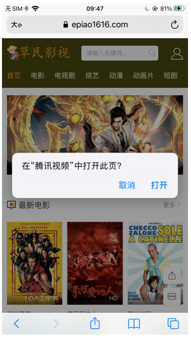
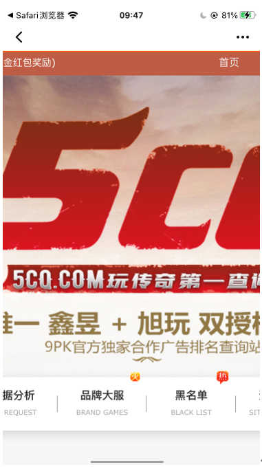
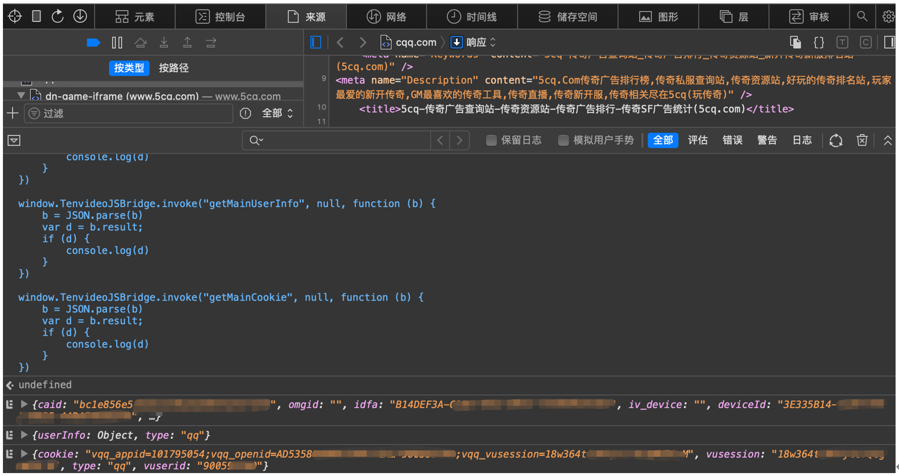
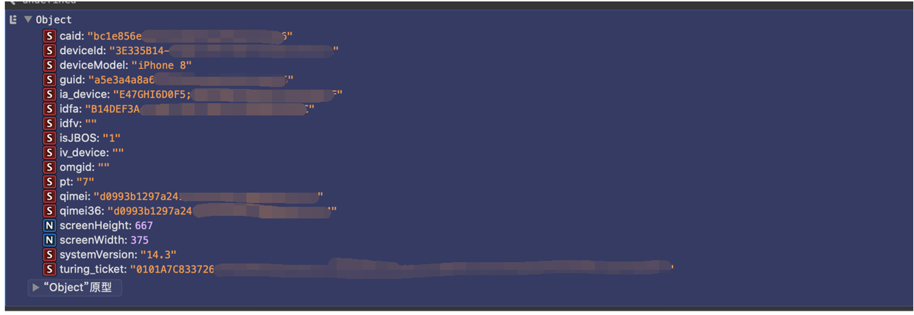
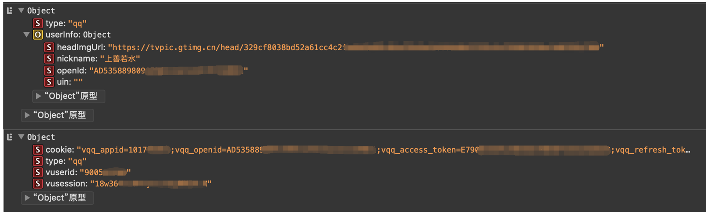
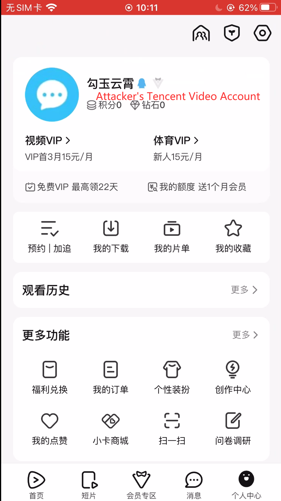
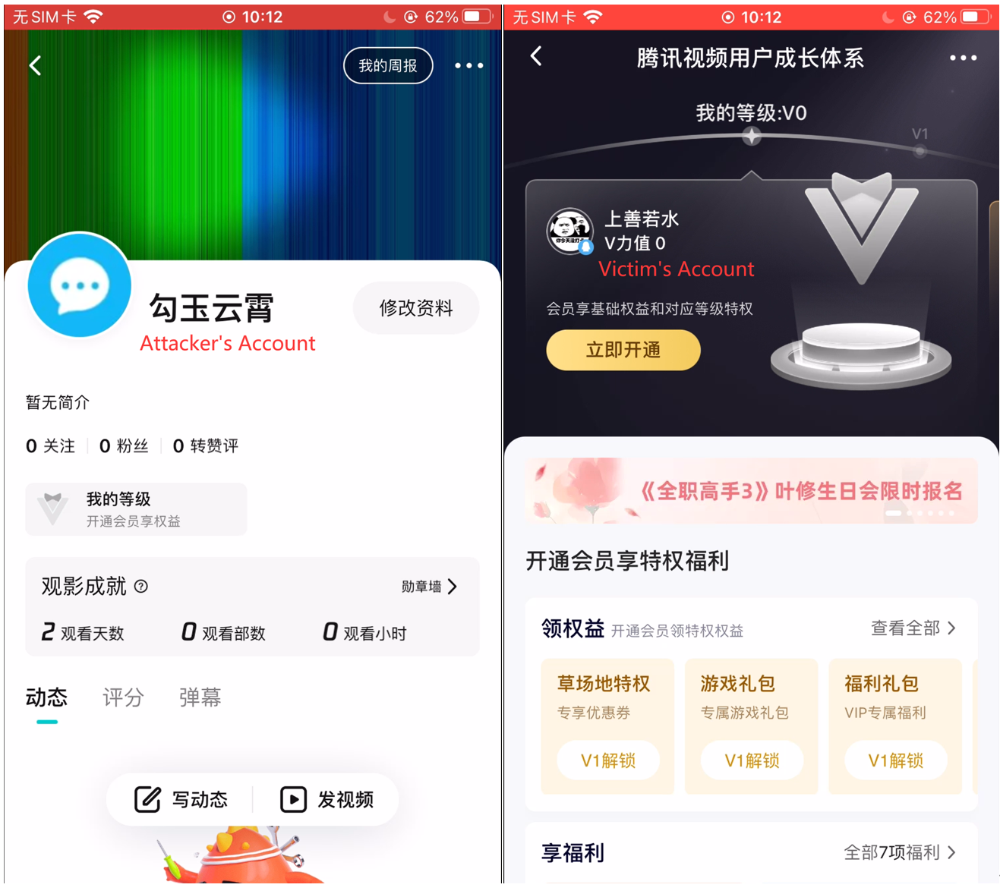

## An information leak vulnerability in the iOS version of Tencent Video

### Brief Description

The iOS version of the Tencent Video supports opening web pages from external deep link URL (Scheme). Within the built-in WKWebView, there are **custom interfaces** designed for invocation within web pages. These interfaces are subject to domain name checks when being invoked, allowing only privileged domain names listed in the whitelist to access.

However, we discovered a **flaw in the domain name validation** of the Tencent Video, enabling web pages under non-privileged domain name to invoke these privileged sensitive interfaces. We have confirmed that an attacker can craft a malicious URL (Scheme). When clicked by the victim in a browser or another app, the URL (Scheme) can direct the victim to the Tencent Video app and open a web page controlled by the attacker. The attacker can then utilize the web page to invoke privileged interfaces, directly obtaining the victim's sensitive information such as **cookies, nickname, avatar, and device identifier**, leading to **information leak**. Moreover, with the **stolen cookie**, the attacker can **illegitimately log into the victim's Tencent Video account** on some web pages, enabling **unauthorized access**.

### Vulnerability Exploitation Process and Root Cause

The attacker, lures the user to click on a malicious URL (Scheme) in the following format: **tenvideo2://?action=10&openurl=https://xxxqq.com/**. Here, **xxxqq.com** is a domain registered by the attacker and under the attacker's control. The domain should have a suffix related to Tencent Video, such as qq.com. Let's take **"cqq.com"** as an example. Therefore, the malicious URL (Scheme) is **tenvideo2://?action=10&openurl=https://cqq.com/**.

When the victim clicks on this URL (**tenvideo2://?action=10&openurl=https://cqq.com/**), it directs the victim to the Tencent Video app and opens the website **https://cqq.com/** within the app.

Within the webpage hosted on **cqq.com**, the attacker **invokes privileged interfaces** registered within the Tencent Video's WKWebView. The Tencent Video app has privileged interfaces that have domain name checks before being accessed. However, **these checks are flawed**. For example, a domain name like **cqq.com is considered privileged** because it **contains the privileged suffix "qq.com"**, granting access to custom sensitive privileged interfaces.

By exploiting this vulnerability, the attacker can obtain the user's **cookie** (such as vqq_access_token, vqq_appid, vqq_openid, vqq_vuserid), **account avatar, nickname, GUID**, and other user account and device information, resulting in **information leakage**.

In the verification experiment, as we haven't actually registered and controlled such a website like cqq.com, we used the existed https://cqq.com/ and performed the remote debugging by Safari on macOS to inject the code into the webpage.

The attacker can further replace their own cookie with the victim's cookie within the Tencent Video client. This allows them to **access the victim's Tencent Video account** on certain web pages, enabling **unauthorized access**. The following screenshots show the process.

The attacker first logs into his own Tencent Video account:

The attacker uses Frida to replace the cookie and then send network requests to access some web pages. Then they will enter the victim's Tencent Video account:

### Impact of the Vulnerability

**Scope of the vulnerability**: Tencent Video iOS version 8.10.90 Build 25058 (the latest version as of May 26, 2024).

**Consequences of the vulnerability**: Information leak, unauthorized access.